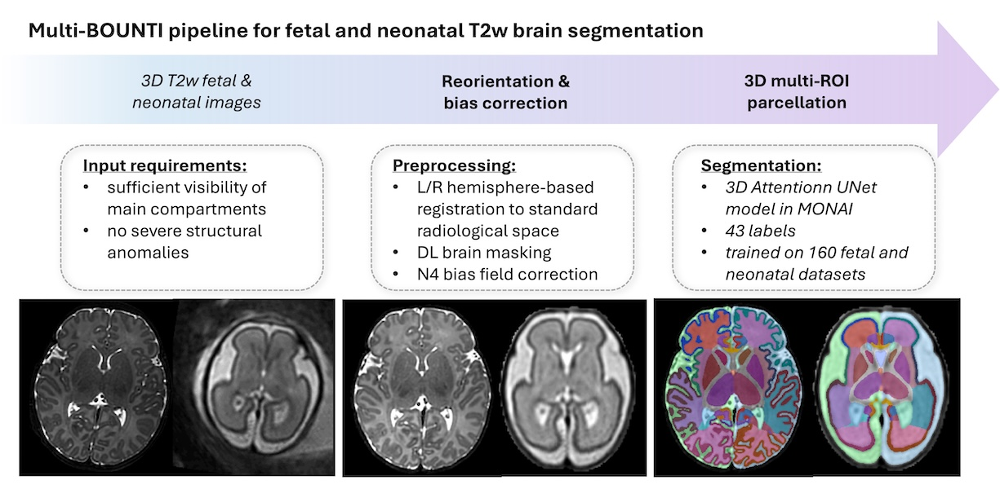

Automated analysis tools for fetal and neonatal brain MRI
====================

This repository contains DL pipelines for [MONAI](https://github.com/Project-MONAI/MONAI)-based automated analysis for fetal and neonatal brain MRI.


- The repository, scripts and models were designed and created at the Department of Early Life Imaging, King's College London.

  
- Please email alena.uus (at) kcl.ac.uk if in case of any questions.


Development of these processing and analysis tools was supported by projects led by Prof Mary Rutherford, Dr Lisa Story, Prof Tomoki Arichi, Prof David Edwards and Prof Jo Hajnal.





Auto processing scripts 
------------------------


**The automated docker tags are _fetalsvrtk/svrtk:perinatal_brain_mri_analysis_amd_ (AMD systems only)**


**AUTOMATED 3D T2w BRAIN SEGMENTATION:**

*Input data requirements:*
- sufficient SNR and image quality, no extreme shading artifacts
- good quality 3D SVR 
- full ROI coverage
- standard radiological space
- 25-45 weeks PMA: neonatal
- 20-39 weeks GA: fetal
- no extreme structural anomalies
- 3T

Note: you will need >16GB GPU

```bash

docker pull fetalsvrtk/svrtk:perinatal_brain_mri_analysis_amd

#auto multi-ROI brain tissue segmentation: neonatal
docker run --rm --gpus all --mount type=bind,source=LOCATION_ON_YOUR_MACHINE,target=/home/data  fetalsvrtk/svrtk:perinatal_brain_mri_analysis_amd sh -c ' bash /home/7t-brain-analysis/scripts/run-7t-neo-brain-segmentation-ic-multi-bounti-042026.sh [/home/data/path_to_t2w_recon.nii.gz] [/home/data/path_to_tmp_processing_folder] [/home/data/path_to_output_multi_tissue_label.nii.gz] [/home/data/path_to_output_ic_wm_label.nii.gz] ; '


```


License
-------

The AURORA code and all scripts are distributed under the terms of the
[GNU General Public License v3.0](https://www.gnu.org/licenses/gpl-3.0.en.html). This program is free software: you can redistribute it and/or modify it under the terms of the GNU General Public License as published by the Free Software Foundation version 3 of the License. 

This software is distributed in the hope that it will be useful, but WITHOUT ANY WARRANTY; without even the implied warranty of MERCHANTABILITY or FITNESS FOR A PARTICULAR PURPOSE.  See the GNU General Public License for more details.


Citation and acknowledgements
-----------------------------

In case you found this repository useful please give appropriate credit to the software.


**Brain tissue segmentation (will be updated soon):**
> Uus, A. U., Kyriakopoulou, V., Makropoulos, A., Fukami-Gartner, A., Cromb, D., Davidson, A., Cordero-Grande, L., Price, A. N., Grigorescu, I., Williams, L. Z. J., Robinson, E. C., Lloyd, D., Pushparajah, K., Story, L., Hutter, J., Counsell, S. J., Edwards, A. D., Rutherford, M. A., Hajnal, J. V., Deprez, M. (2023) BOUNTI: Brain vOlumetry and aUtomated parcellatioN for 3D feTal MRI. eLife 12:RP88818; doi: https://doi.org/10.7554/eLife.88818.1


Disclaimer
-------

This software has been developed for research purposes only, and hence should not be used as a diagnostic tool. In no event shall the authors or distributors be liable to any direct, indirect, special, incidental, or consequential damages arising of the use of this software, its documentation, or any derivatives thereof, even if the authors have been advised of the possibility of such damage.

