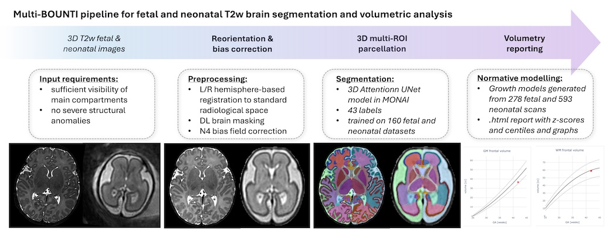

Automated analysis tools for fetal and neonatal brain MRI
====================

This repository contains DL pipelines for [MONAI](https://github.com/Project-MONAI/MONAI)-based automated analysis for fetal and neonatal brain MRI.


- The repository, scripts and models were designed and created at the Department of Early Life Imaging, King's College London.

  
- Please email alena.uus (at) kcl.ac.uk if in case of any questions.


**- IMPORTANT NOTES:**

**- this is a new method and we would be very grateful for your feedback so that it can be improved! Please email us.**

**- the current version of the pipeline was trained on dHCP datasets only - it might not work on other acquisitions.**


Development of these processing and analysis tools was supported by projects led by Prof Mary Rutherford, Dr Lisa Story, Prof Tomoki Arichi, Prof David Edwards and Prof Jo Hajnal.





Auto processing scripts 
------------------------


**The automated docker tags are _fetalsvrtk/svrtk:perinatal_brain_mri_analysis_amd_ (AMD systems only)**


**AUTOMATED Multi-BOUNTI SEGMENTATION FOR 3D T2W BRAIN MRI:**

*Input data requirements:*
- sufficient SNR and image quality, no extreme shading artifacts
- good quality 3D SVR
- fetal TE=250ms - dHCP protocol 
- full ROI coverage
- standard radiological space
- 25-45 weeks PMA: neonatal
- 22-39 weeks GA: fetal
- no extreme structural anomalies
- 3T
- **!!! 0.5mm resolution (please reconstruct to 0.5mm isotropic (see below) or resample to 0.5mm before running segmentation)**
  
Note: you will need >16GB GPU


**PLEASE RUN IT DIRECTLY VIA OUR DOCKER:**


```bash

docker pull fetalsvrtk/svrtk:perinatal_brain_mri_analysis_amd


# auto Multi-BOUNTI brain tissue segmentation: fetal dHCP acquisition
docker run --rm --gpus all --mount type=bind,source=LOCATION_ON_YOUR_MACHINE,target=/home/data  fetalsvrtk/svrtk:perinatal_brain_mri_analysis_amd sh -c ' bash /home/perinatal-brain-mri-analysis/scripts/run-multi-bounti-fetal-brain-segmentation-2026-dhcp.sh [N4 correction: 1 - yes; 0 - no] [/home/data/path_to_t2w_recon.nii.gz] [/home/data/path_to_tmp_processing_folder] [/home/data/path_to_output_multi_tissue_bounti_label.nii.gz]  ; '

# auto Multi-BOUNTI brain tissue segmentation: fetal general acquisition
docker run --rm --gpus all --mount type=bind,source=LOCATION_ON_YOUR_MACHINE,target=/home/data  fetalsvrtk/svrtk:perinatal_brain_mri_analysis_amd sh -c ' bash /home/perinatal-brain-mri-analysis/scripts/run-multi-bounti-fetal-brain-segmentation-2026-general.sh [N4 correction: 1 - yes; 0 - no] [/home/data/path_to_t2w_recon.nii.gz] [/home/data/path_to_tmp_processing_folder] [/home/data/path_to_output_multi_tissue_bounti_label.nii.gz]  ; '

# auto Multi-BOUNTI brain tissue segmentation: neonatal dHCP acquisition
docker run --rm --gpus all --mount type=bind,source=LOCATION_ON_YOUR_MACHINE,target=/home/data  fetalsvrtk/svrtk:perinatal_brain_mri_analysis_amd sh -c ' bash /home/perinatal-brain-mri-analysis/scripts/run-multi-bounti-neo-brain-segmentation-2026-dhcp.sh [N4 correction: 1 - yes; 0 - no] [/home/data/path_to_t2w_recon.nii.gz] [/home/data/path_to_tmp_processing_folder] [/home/data/path_to_output_multi_tissue_bounti_label.nii.gz]  ; '


# volumetry reporting for Multi-BOUNTI in .html: fetal
docker run --rm  --mount type=bind,source=LOCATION_ON_YOUR_MACHINE,target=/home/data  fetalsvrtk/svrtk:perinatal_brain_mri_analysis_amd sh -c ' python3 /home/perinatal-brain-mri-analysis/scripts/scripts/auto-reporting-multi-bounti-brain-volumetry-fetal.py CASE_ID GA DATE /home/data/vol-test/brain-svr-file.nii.gz /home/data/brain-tissue-segmenation-file.nii.gz /home/data/name-for-volumetry-report.html ; chmod 777 /home/data/name-for-volumetry-report.html  '


# volumetry reporting for Multi-BOUNTI in .html: neonatal
docker run --rm  --mount type=bind,source=LOCATION_ON_YOUR_MACHINE,target=/home/data  fetalsvrtk/svrtk:perinatal_brain_mri_analysis_amd sh -c ' python3 /home/perinatal-brain-mri-analysis/scripts/scripts/auto-reporting-multi-bounti-brain-volumetry-neo.py CASE_ID GA DATE /home/data/vol-test/brain-svr-file.nii.gz /home/data/brain-tissue-segmenation-file.nii.gz /home/data/name-for-volumetry-report.html ; chmod 777 /home/data/name-for-volumetry-report.html  '


```


**EXAMPLE FOR NEONATAL SEGMENTATION:**

```bash

docker run --rm --gpus all --mount type=bind,source=/home/au18/folder_with_datasets,target=/home/data  fetalsvrtk/svrtk:perinatal_brain_mri_analysis_amd sh -c ' bash /home/perinatal-brain-mri-analysis/scripts/run-multi-bounti-neo-brain-segmentation-2026-dhcp.sh /home/data/neo_svr_recon.nii.gz /home/data/tmp /home/data/multi_tissue_bounti_label.nii.gz  ; '

```


**EXAMPLE HOW TO RESAMPLE AN IMAGE TO 0.5MM RESOLUTION:**

```bash

docker run --rm --mount type=bind,source=/home/au18/folder_with_datasets,target=/home/data  fetalsvrtk/svrtk:perinatal_brain_mri_analysis_amd sh -c ' cd /home/data ; mirtk resample-image org.nii.gz resampled.nii.gz -size 0.5 0.5 0.5 ; mirtk nan resampled.nii.gz 1000000  ; chmod 777 resampled.nii.gz ;  '

```


**AUTOMATED SVR RECONSTRUCTION FOR NEONATAL T2W BRAIN MRI:**
   

**- FETAL SVR RECONSTRUCTION - PLEASE GO TO: https://github.com/SVRTK/auto-proc-svrtk**

**- NEONATAL SVR RECONSTRUCTION:**

*Input data requirements:*
- 2-4 T2w stacks
- no extreme motion artifacts (better to exclude low quality stacks)
- sufficient ROI oversampling
- template selection: best quality stack with full brain coverage
- please run with 0.5mm output resolution


```bash

docker pull fetalsvrtk/svrtk:perinatal_brain_mri_analysis_amd


# auto neonatal brain SVR reconstruction (Kuklisova-Murgasova,2012)
docker run --rm --mount type=bind,source=LOCATION_ON_YOUR_MACHINE,target=/home/data  fetalsvrtk/svrtk:perinatal_brain_mri_analysis_amd sh -c ' cd /home/data ; mkdir out ; cd out ; mirtk reconstruct ../name_for_output_svr.nii.gz [number_of_stacks; e.g., 3] ../input_stack1.nii.gz ../input_stack2.nii.gz ../input_stackN.nii.gz -default_thickness [slice_thickness; e.g., 1.5] -resolution 0.5 -iterations 1 -sr_iterations 3 -remove_black_background -svr_only -template ../template_stack.nii.gz ; chmod 777 ../name_for_output_svr.nii.gz ;  '

```

**EXAMPLE:**

```bash

docker run --rm --mount type=bind,source=/home/au18/folder_with_datasets,target=/home/data  fetalsvrtk/svrtk:perinatal_brain_mri_analysis_amd sh -c ' cd /home/data ; mkdir out ; cd out ; mirtk reconstruct ../output_svr.nii.gz 2 ../input_stack1.nii.gz ../input_stack2.nii.gz -default_thickness 1.0 -resolution 0.5 -iterations 2 -sr_iterations 3 -remove_black_background -svr_only -template ../input_stack1.nii.gz ; chmod 777 ../output_svr.nii.gz ;  '

```


**AUTOMATED BRAIN SURFACE RECONSTRUCTION FROM MULTI-BOUNTI (BASED ON DRAW-EM):**

*Notes:*
- please use the specific input ID format: e.g., **sub-060_ses-01**
- please QC, refine the input segmentations before running surfaces

```bash

docker pull fetalsvrtk/surface:multi_bounti_2026
 
docker run --rm --mount type=bind,source=[full_path_to_folder_on_computer],target=/home/data  fetalsvrtk/surface:multi_bounti_2026 sh -c ' bash /software/surface-scripts/multi-bounti-surface-generation-042026-v7.sh sub-[subject_id]_ses-[session_number] /home/data/[full_path_to_bounti_label_within_docker_mount] /home/data/[full_path_to_bounti_label_within_docker_mount] /home/data/[full_path_to_output_surface_folder_within_docker_mount] 0  ; '
 
# example

docker run --rm --mount type=bind,source=/scratch/7t/alena/surface-tests-042026,target=/home/data  fetalsvrtk/surface:multi_bounti_2026 sh -c ' bash /home/data/multi-bounti-surface-generation-042026-v7.sh sub-060_ses-01 /home/data/bounti-lab/bounti-lab-sh-neo-060_ses-01_7t_recon.nii.gz /home/data/bounti-lab/bounti-lab-sh-neo-060_ses-01_7t_recon.nii.gz /home/data/surface-neo-060_ses-01 0  ;


```


License
-------

The code and model weights are distributed under the terms of the
[GNU General Public License v3.0](https://www.gnu.org/licenses/gpl-3.0.en.html). This program is free software: you can redistribute it and/or modify it under the terms of the GNU General Public License as published by the Free Software Foundation version 3 of the License. 

This software is distributed in the hope that it will be useful, but WITHOUT ANY WARRANTY; without even the implied warranty of MERCHANTABILITY or FITNESS FOR A PARTICULAR PURPOSE.  See the GNU General Public License for more details.


Citation and acknowledgements
-----------------------------

In case you found this repository useful please give appropriate credit to the software.


**Multi-BOUNTI segmentation:**
> Uus, A., Fukami-Gartner, A., Kyriakopoulou, V., Cromb, D., Morgan, T., Arulkumaran, S., Egloff Collado, A., Luis, A., Bos, R., Makropoulos, A., Schuh, A., Robinson, E., Sousa, H., Deprez, M., Cordero-Grande, L., Bradshaw, C., Colford, K., Hutter, J., Price, A., O’Muircheartaigh, J., Hammers, A., Rueckert, D., Counsell, S., McAlonan, G., Arichi, T., Edwards, A. D., Hajnal, J. V., Rutherford, M. A., Story, L. (2026). Multi-BOUNTI: Multi-lobe Brain vOlUmetry and segmeNtation for feTal and neonatal MRI. medRxiv, 2026.04.21.26351376. https://doi.org/10.64898/2026.04.21.26351376

**Neonatal brain reconstruction:**
> Kuklisova-Murgasova, M., Quaghebeur, G., Rutherford, M. A., Hajnal, J. V., & Schnabel, J. A. (2012). Reconstruction of fetal brain MRI with intensity matching and complete outlier removal. Medical Image Analysis, 16(8), 1550–1564.: https://doi.org/10.1016/j.media.2012.07.004

**Draw-EM brain surface reconstruction:**
> Makropoulos A, Robinson EC, Schuh A, Wright R, Fitzgibbon S, Bozek J, Counsell SJ, Steinweg J, Vecchiato K, Passerat-Palmbach J, Lenz G, Mortari F, Tenev T, Duff EP, Bastiani M, Cordero-Grande L, Hughes E, Tusor N, Tournier JD, Hutter J, Price AN, Teixeira RPAG, Murgasova M, Victor S, Kelly C, Rutherford MA, Smith SM, Edwards AD, Hajnal JV, Jenkinson M, Rueckert D. The developing human connectome project: A minimal processing pipeline for neonatal cortical surface reconstruction. Neuroimage. 2018 Jun;173:88-112. doi: [https://doi.org/10.1016/j.neuroimage.2018.01.054](https://doi.org/10.1016/j.neuroimage.2018.01.054).


Disclaimer
-------

This software has been developed for research purposes only, and hence should not be used as a diagnostic tool. In no event shall the authors or distributors be liable to any direct, indirect, special, incidental, or consequential damages arising of the use of this software, its documentation, or any derivatives thereof, even if the authors have been advised of the possibility of such damage.

